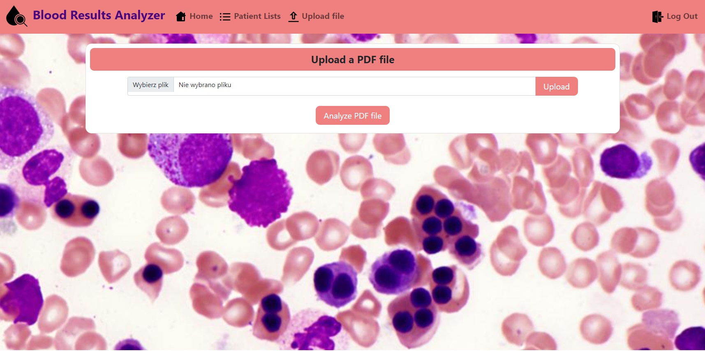
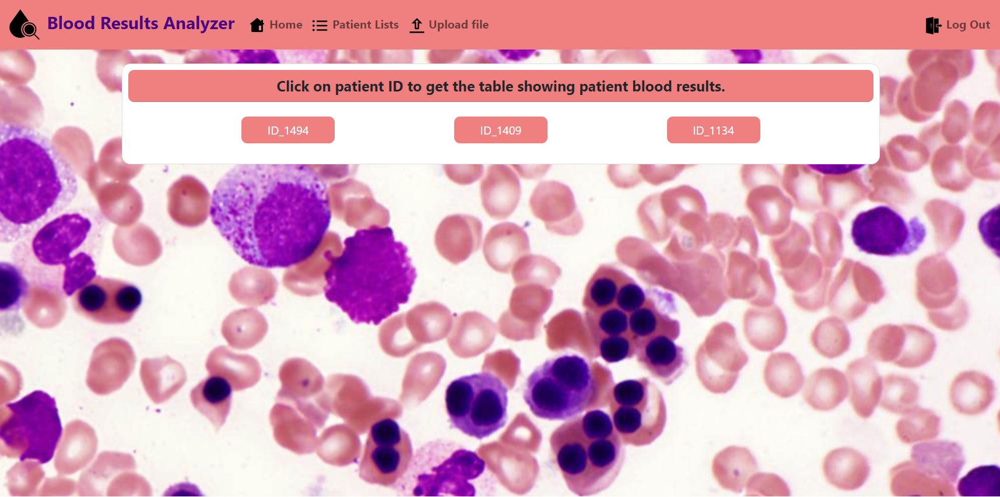
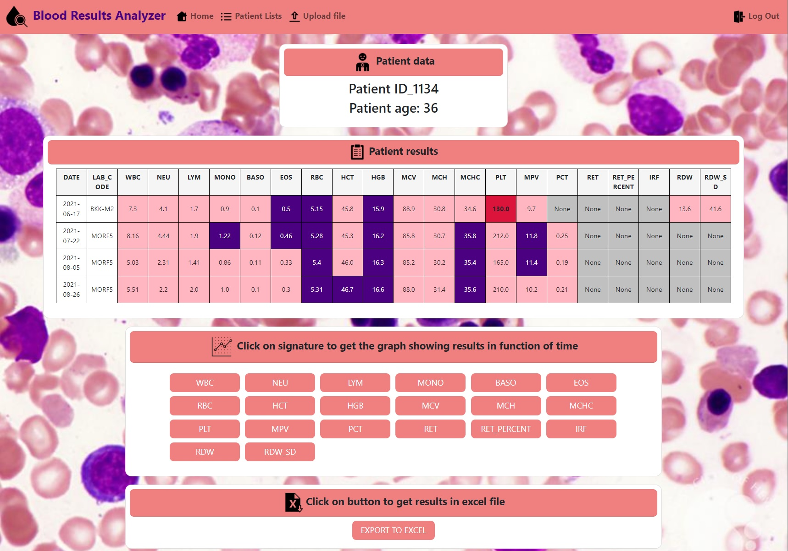
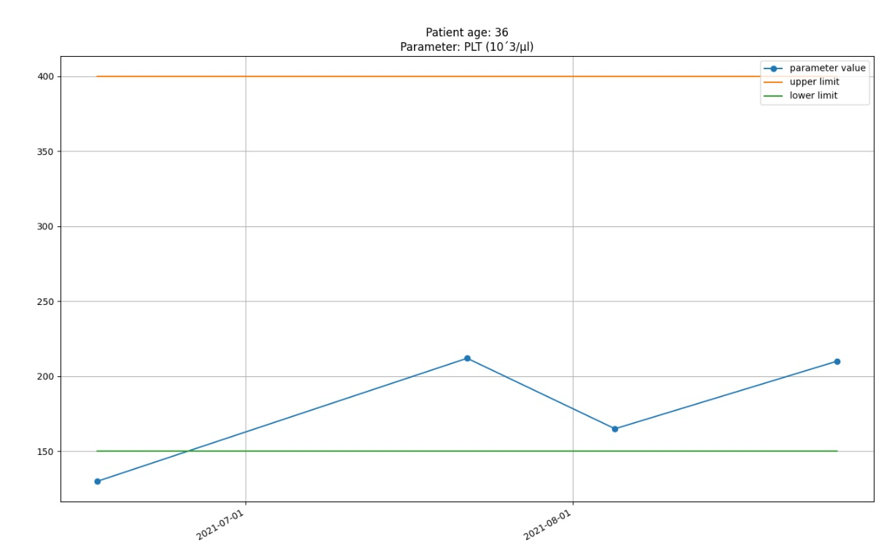

# Blood Analyzer

# Table of contents
* [General info](#general-info)
* [Technologies](#technologies)
* [Printscreens](#printscreens)

## General info

    
Click here to see general information about application!

         
        Blood Analyzer is an app which allows to parse data from PDF and save it to DataBase. Data are the blood parameters
        extracted from human blood by blood analyzer machine.
         
        App gives user following possibilities:
        <li>Upload and parse PDF with blood parameters:</li>
        <li>Save results into Data Base.</li>
        <li>Create new patient card with unique ID if not exists. ID is integer converted from personal data.</li>
        <li>Browse existing patient cards to check blood results stored as a table where rows are date and columns are blood parameters:</li>
        <li>Clearly shows which parameter is out of the norm. Red color is below the norm. Violet color is above the norm.</li>
        <li>Show graph for particular blood parameter. Graph shows parameter values in function of time.</li>
        <li>Export table with results to excel file.</li>

## Technologies

    
Click here to see the technologies used!

        <ul>
            <li>Python 3.8.5</li>
            <li>Flask</li>
            <li>SQL Flask Alchemy</li>
            <li>HTML 5</li>
            <li>CSS 3</li>
            <li>Docker</li>
            <li>Docker Compose</li>
            <li>Bootstrap</li>
            <li>PDF Plumber</li>
            <li>Matplot</li>
        </ul>

## PrintScreens

Click here to see general information about application!

Page with upload and PDF parse functionality.

Page with patient card selection.

Page with patient results, graph, and excel file export.

Example of plotted graph.

